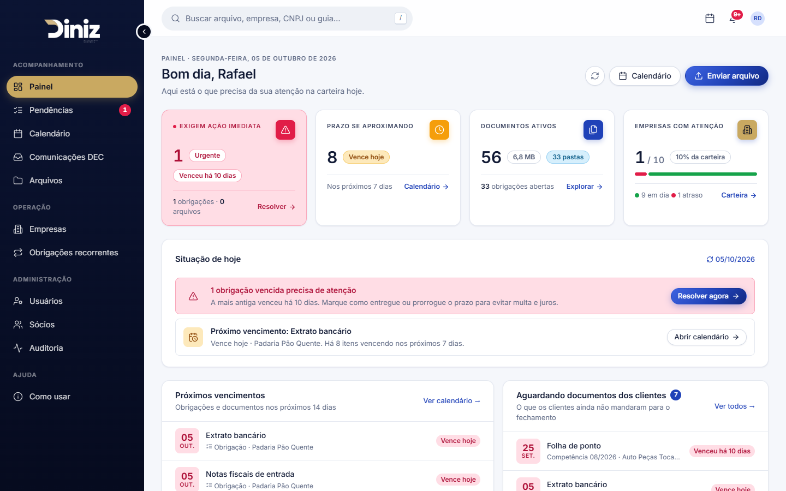
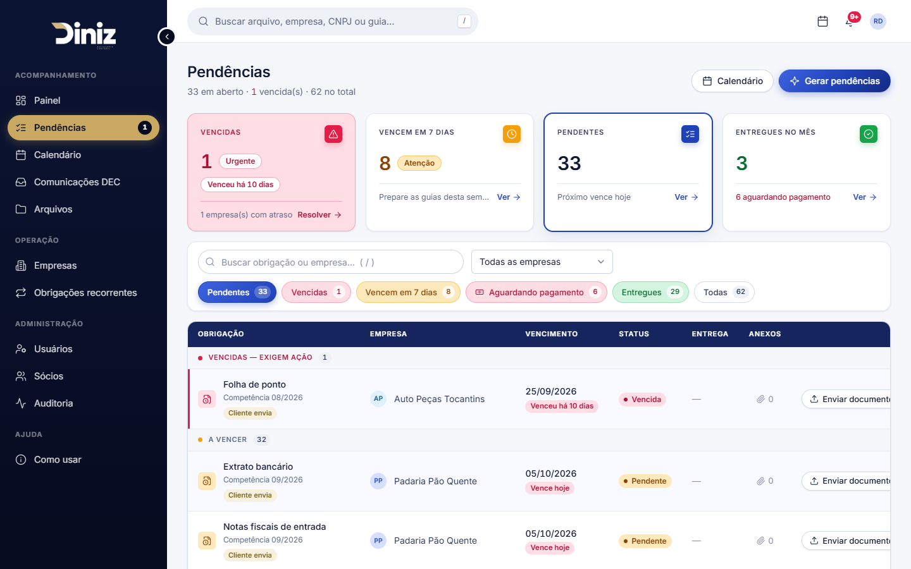
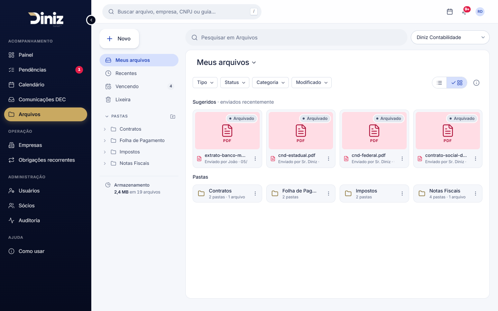
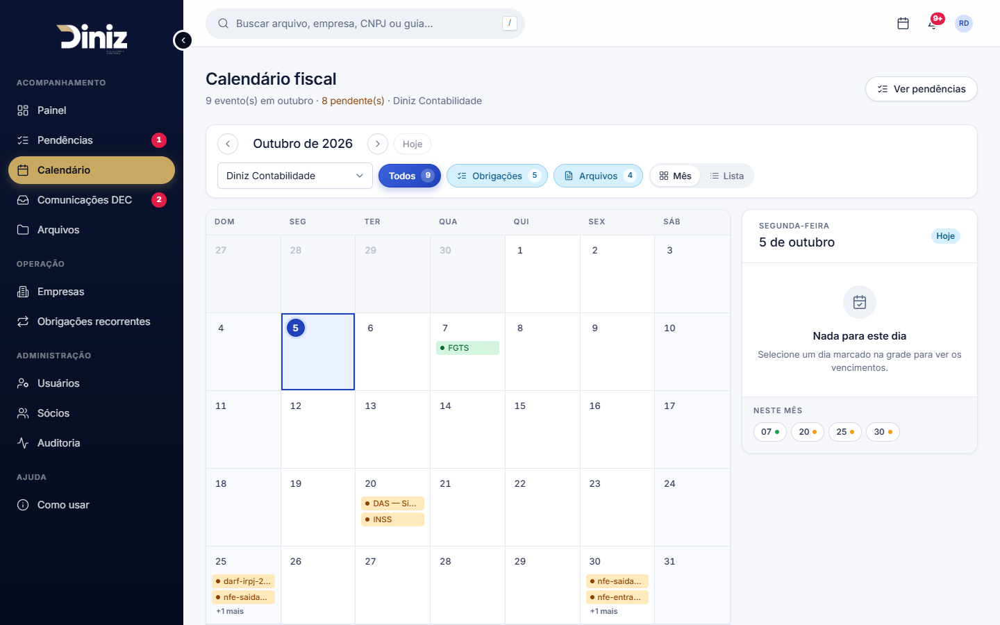
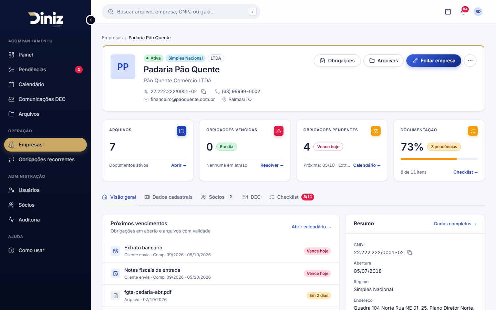

# Gerenciador Diniz — Front-end

Interface web do **Gerenciador Diniz**, portal que reúne documentos, prazos e obrigações fiscais entre o
escritório Diniz Assessoria Contábil e as empresas clientes, com as comunicações da SEFAZ-TO (DEC) integradas.

- **Demonstração:** https://gerenciador-diniz.vercel.app
- **API e documentação completa** (funcionalidades, arquitetura, logins de demonstração):
  [GerenciadorDeArquivosDiniz](https://github.com/rafaelsdiniz/GerenciadorDeArquivosDiniz)

**Logins de demonstração** (senha `123456`): escritório `rafael@diniz.com.br` · cliente `maria@paoquente.com.br`.
Dentro do sistema, abra **Como usar** no menu lateral para o roteiro de teste.

## Módulos

Painel · Pendências (com confirmação de pagamento e mensagens por obrigação) · Calendário · Comunicações DEC ·
Arquivos estilo Drive (com lixeira e leitura de guias por IA) · Empresas · Certidões negativas · Fechamento mensal ·
Relatórios (PDF/CSV) · Obrigações recorrentes · Usuários · Sócios · Auditoria · Assistente virtual (chatbot) · Como usar.

O sistema também pode ser instalado no celular (PWA) e enviar documentos pela câmera.



## Telas

| | |
|---|---|
|  |  |
|  |  |

## Tecnologias

- Angular 20 (componentes standalone, controle de fluxo `@if/@for`, lazy loading por rota)
- Design system próprio em CSS (tokens, componentes globais) — ver [DESIGN.md](DESIGN.md)
- Chart.js / ng2-charts, JSZip, FileSaver
- Ícones Lucide (ISC) e fonte Inter

## Rodando localmente

Pré-requisitos: Node.js 20+ e a [API](https://github.com/rafaelsdiniz/GerenciadorDeArquivosDiniz) rodando em `http://localhost:8080`.

```bash
npm install --legacy-peer-deps
npm start
```

Acesse http://localhost:4200.

O endereço da API fica em `src/environments/environment.ts` (desenvolvimento) e
`src/environments/environment.prod.ts` (produção).

Build de produção:

```bash
npx ng build --configuration production
```

## Publicação

Vercel, com `vercel.json` (instalação com `--legacy-peer-deps`, saída `dist/GerenciadorDinizFront/browser`
e redirecionamento das rotas para o `index.html`).

## Estrutura

```
src/app/
  components/   telas (painel, pendências, calendário, arquivos, empresas, DEC, ajuda…)
  services/     chamadas à API
  models/       contratos (DTOs) e enums
  shared/       ícones, toasts, diálogo de confirmação, paginação, campos aprimorados
  pipes/        formatação (CNPJ/CPF, telefone, prazos, tamanhos)
src/styles.css  design system (tokens e componentes)
```

## Créditos

Referência de design: [awesome-claude-design](https://github.com/VoltAgent/awesome-claude-design) (MIT), adaptada às
cores da marca Diniz. Desenvolvimento com apoio do assistente de IA Claude Code (Anthropic), registrado nos commits.
